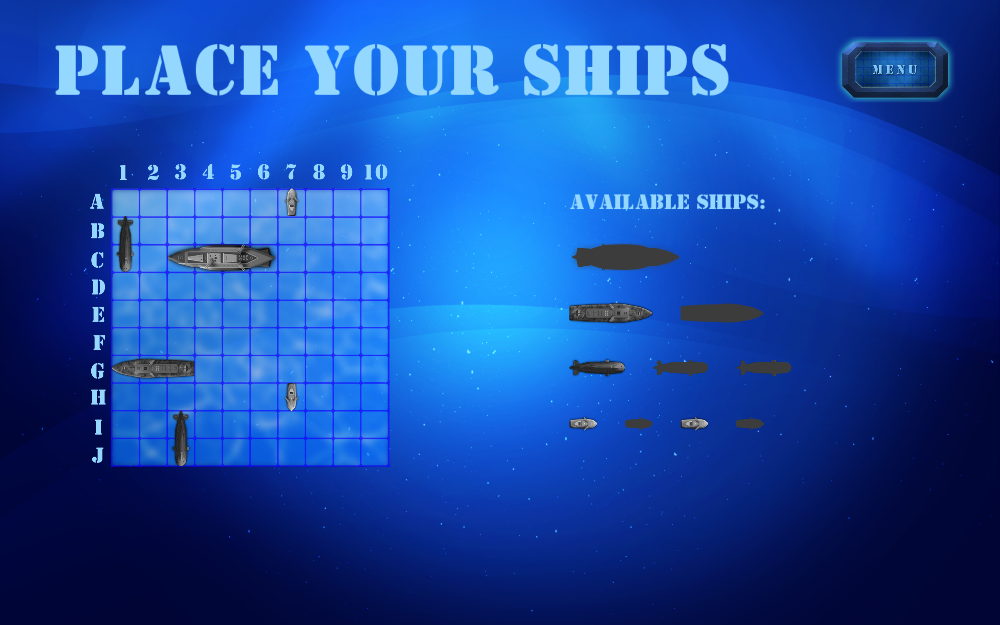

# Welcome to my "Sea Battle" game!
 

## Game screenshots

  
Expand me

  
#### Logo

#### Placing ships

#### Battle field

#### Victory

  

## Installers
* Please find installers for supported platforms in folder /installers/

## Project Setup
* Download and install the latest stable Cocos2d-x game engine [version](https://cocos2d-x.org/download)
* Download and install tools: [Android SDK](https://developer.android.com/sdk/index.html), [Android NDK](https://developer.android.com/tools/sdk/ndk/index.html), [ANT](https://ant.apache.org/)
* Add global variables to `$PATH`
* Git clone https://github.com/maksymbazala/seabattlegame.git (note that [git-lfs](https://git-lfs.github.com/) extension is used!)

## Cocos Console
Run next commands in project directory:
* To compile: `cocos compile -p <platform> -m <mode>` (e.g. *cocos compile -p mac -m debug*)
* To deploy: `cocos deploy -p <platform> -m <mode>` (e.g. *cocos deploy -p win32 -m release*)
* To run: `cocos run -p <platform> -m <mode>` (e.g. *cocos run -p mac -m release*)

## Supported Platforms
* macOS
* win10
 

> Developed by Maksym Bazala
\
> Sprites by Anna Panich
 

*No commercial purposes, just for fun and with love.*
